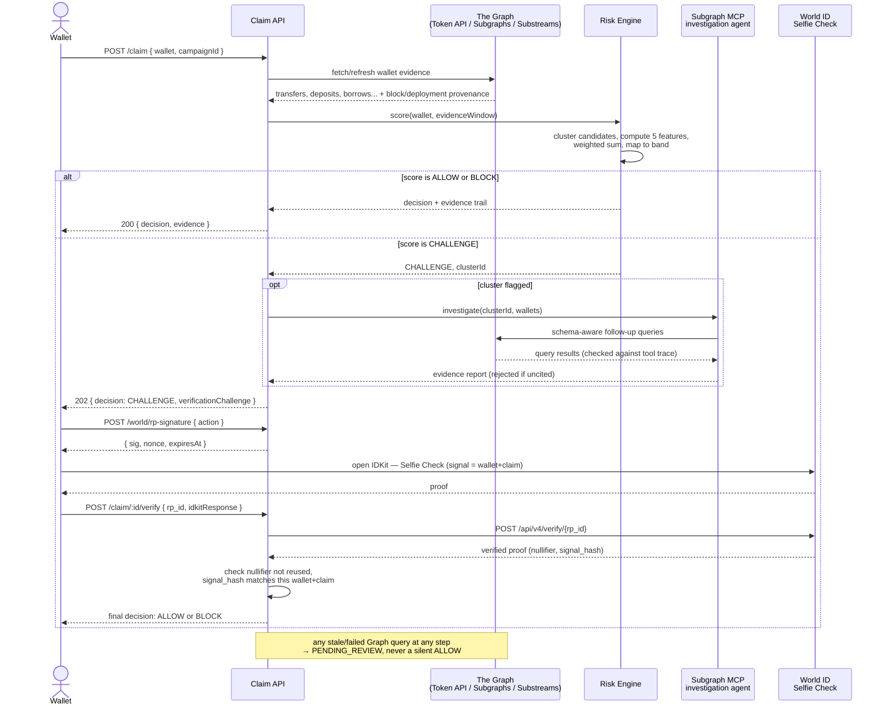

# Xander

**A Graph-native, cross-protocol coordinated-actor risk engine, with World Selfie Check as a selective escalation layer.**

Xander sits in front of a token claim or DeFi incentive action. It builds a live evidence layer from **The Graph**, turns that evidence into a deterministic, explainable risk score per wallet/cluster, uses an AI investigation agent to explain *why* a cluster is flagged, and — only when risk crosses a threshold — escalates to **World ID Selfie Check** for a biometric liveness/uniqueness signal before the protocol allows, challenges, or blocks the claim.

Built for **ETHOnline 2026**, targeting two sponsor prizes:

| Track | Sponsor | Prize |
|---|---|---|
| Best Use of Composable or Standardized Graph Products | The Graph | $5,000 |
| Selfie Check | World | $7,000 pool (up to 3 teams, ~$1,166 each) |

---

## Table of contents

- [The problem](#the-problem)
- [The solution](#the-solution)
- [Market opportunity](#market-opportunity)
- [How it works](#how-it-works)
- [Claim flow — sequence diagram](#claim-flow--sequence-diagram)
- [The Graph — how each product is used](#the-graph--how-each-product-is-used)
- [Try it live — query the deployed subgraph](#try-it-live--query-the-deployed-subgraph)
- [World ID — Selfie Check as a selective signal](#world-id--selfie-check-as-a-selective-signal)
- [Architecture](#architecture)
- [Tech stack](#tech-stack)
- [Repository layout](#repository-layout)
- [Build status](#build-status)
- [Running it locally](#running-it-locally)
- [Team](#team)

---

## The problem

Every major token airdrop or claim campaign of the last two years has had to fight the same battle at real scale, after the fact, with blunt tools:

- **LayerZero** flagged **over 800,000 sybil addresses** in its May 2024 crackdown, out of a pool of 1.28M wallets ultimately deemed eligible — and its CEO separately said up to 100,000 addresses self-reported as sybils under an amnesty program.
- **Linea's** 2025 airdrop sweep initially flagged **50.45%** of its 1,297,203 eligible wallets — over half — before refinement narrowed the actual exclusion down to 516,960 wallets (39.85%). That gap, ~137,000 wallets, is the cost of a detector with no auditable trail: nobody could tell a falsely-flagged user *why*, so the number had to be walked back after the fact.
- **Arbitrum's** 2023 anti-sybil mechanism used shared-funding-source clustering — the same signal this project uses — with no exclusion list for exchange/bridge/faucet addresses. The documented result: real users who happened to withdraw from the same hot wallet were restricted, while the actual sybils it was designed to catch mostly weren't.
- **LayerZero's** bounty-driven sybil-reporting program produced, by community accounts, "thousands of false positives... detected and forgiven in further lists" — a direct consequence of paying humans to flag addresses with no downstream audit.

The pattern across all four: **detection happens once, after the campaign, entirely inside the sponsor's backend, with no reasoning a flagged user or an outside reviewer can actually inspect.** A wallet is silently excluded or silently allowed, and the only appeal process is a forum thread.

Xander exists to fix the part of this that's actually fixable in a hackathon-sized backend: make every decision **provenance-backed and reproducible**, and reserve the invasive step — biometric verification — for the wallets that actually need it, not the entire eligible pool.

## The solution

1. **Evidence, not assumption.** Every fact behind a risk score — a transfer, a deposit, a borrow — is pulled live from The Graph and stored with its source, its deployment, and its block number attached. Nothing is inferred or fabricated.
2. **Deterministic scoring, not a black box.** Five named features (funding correlation, timing correlation, wallet-age similarity, shared-counterparty overlap, protocol-behavior similarity), each computed by an auditable formula, combined by weights stored in a database table — never a hardcoded number a judge (or a falsely-flagged user) can't inspect.
3. **A known-funder registry, so the Arbitrum heuristic can't misfire the same way.** Shared funding source — the exact signal that produced Arbitrum's false positives — is checked against a table of labeled exchange hot wallets and bridge contracts before it counts. Labelled and unlabelled funders are scored *separately* and the higher wins, so a benign shared funder is heavily down-weighted while a ring cannot launder a coordination signal by routing one extra transfer through an exchange. It down-weights rather than excludes on purpose: a ring genuinely can be run out of one exchange account. Currently seeded with 10 bridge contracts (first-party docs) and 100 exchange hot wallets (only addresses two independent label datasets agree on). The `FAUCET` category is supported but empty — no faucet operator publishes its dispenser address, and inventing one would defeat the point. This is the single most important lesson pulled directly from the airdrop precedents above.
4. **AI investigates, it doesn't decide.** When a cluster is flagged, an investigation agent (via The Graph's Subgraph MCP) explains *what* it found and *where it queried it from* — every claim in its report is checked against its own tool-call trace before being trusted. The number that gates the claim always comes from the deterministic scorer, never from the agent's prose.
5. **Biometric verification only for the wallets that need it.** World ID Selfie Check is never shown to a low-risk wallet. It appears exactly once risk crosses an explicit, config-driven threshold — turning an invasive step into a targeted one instead of a blanket gate applied to everyone.
6. **Fail closed, never fail open.** A stale Graph query, an unhealthy deployment, a timed-out World verification — none of these silently resolve to `ALLOW`. They resolve to `PENDING_REVIEW`. An unknown wallet is not a safe wallet.

## Market opportunity

- **Airdrop sybil defense is now a standing line item, not a one-off.** Arbitrum, Optimism, Linea, and LayerZero have each built or bought sybil detection at real scale in the last two years; the next wave of L2s, DeFi protocols, and points programs will need the same infrastructure, repeatedly, per campaign.
- **The status quo is a one-time, opaque, backend-only sweep.** None of the four precedents above give a flagged user a reason, and all of them were rebuilt from scratch per campaign. A reusable, provenance-first risk engine that any protocol can point at its own campaign is a real gap, not a hypothetical one.
- **The Graph's Standardized Subgraphs make "cross-protocol" tractable for the first time.** Before the Messari schema standard, detecting coordinated behavior across Aave, Compound, and a dozen other lending markets meant a custom adapter per protocol. One shared schema means one query pattern — this is the exact "standards leverage" the composability track rewards, and it's what turns a single-protocol sybil filter into a general-purpose one.
- **Selective biometric escalation is a better fit for real products than blanket verification.** A DeFi protocol asking every claimant for a face scan will lose legitimate users at the door. Gating it behind a real, explainable risk signal — this project's whole design — is the shape an actual production integration would need, not just a hackathon demo.

## How it works

```
   wallet submits a claim
            │
            ▼
   ┌─────────────────────┐
   │   Evidence layer     │  Token API + Standardized Subgraphs + Substreams
   │   (The Graph)         │  → normalized EvidenceEvent rows, provenance attached
   └─────────┬────────────┘
             ▼
   ┌─────────────────────┐
   │   Behavior graph &    │  funding correlation, timing, wallet age,
   │   clustering           │  shared counterparties, protocol-path similarity
   └─────────┬────────────┘
             ▼
   ┌─────────────────────┐
   │   Deterministic       │  weighted score, config-driven bands
   │   risk scoring         │  → ALLOW / CHALLENGE / BLOCK / PENDING_REVIEW
   └─────────┬────────────┘
             ▼
       score in CHALLENGE band?
       │                    │
       no                   yes
       │                    ▼
       │         ┌─────────────────────┐
       │         │  World ID Selfie      │  biometric liveness + uniqueness,
       │         │  Check (selective)     │  bound to this exact wallet + claim
       │         └─────────┬────────────┘
       │                   │
       ▼                   ▼
            final decision + full evidence trail
```

## Claim flow — sequence diagram



## The Graph — how each product is used

The Graph is the evidence layer for the entire product. Four of its products are composed into one pipeline, driven by **one schema-family query pattern reused across every protocol supported** — that reuse, not any single API call, is the actual composability claim.

| Product | Role in Xander | What it answers |
|---|---|---|
| **Token API** | Historical wallet-level evidence (REST) | Who funded this wallet, when, from how many sources, when did it first appear on-chain |
| **Standardized Subgraphs** | Cross-protocol DeFi behavior (GraphQL, one query per schema family — Messari lending-cdp, dex-amm, yield-aggregator) | Has this wallet borrowed, supplied, swapped, or farmed — across *any* protocol tagged into that schema family, with zero protocol-specific code |
| **Substreams** | Real-time streaming ingestion (Rust/WASM module → gRPC) | New funding transfers and claim events, as they happen, with cursor-resumable, reorg-safe delivery |
| **Subgraph MCP** | AI investigation agent, via Mastra | When a cluster is flagged, what shared behavior actually explains it — with every claim checked against the agent's own real tool-call trace before being trusted |

The `DeploymentRegistryEntry` table is the single place "which protocols we support" lives — adding a new lending protocol is an `INSERT`, never a code change. The same `lending-cdp` query module already runs, unmodified, against every deployment tagged into that schema family — that live "add a protocol as data, not code" moment is the actual demo evidence for the composability track, not just a design paragraph.

**A fifth Graph product is deployed as a standalone, directly-queryable artifact** alongside the pipeline above: a real **Subgraph Studio** subgraph (`xander`), indexing live Base Sepolia USDC `Transfer` events, deployed and synced end-to-end at **`v0.0.3`** — see [Try it live](#try-it-live--query-the-deployed-subgraph) below to query it yourself, or `backend/docs/EVIDENCE-RISK-INTERFACE.md` §11 for its full build/query story.

## Try it live — query the deployed subgraph

The `xander` subgraph is deployed and fully synced on **Base Sepolia** at **`v0.0.3`**. No setup needed — open the GraphiQL playground and run this query directly:

**GraphiQL playground:** [`https://api.studio.thegraph.com/query/1758823/xander/v0.0.3`](https://api.studio.thegraph.com/query/1758823/xander/v0.0.3)
**Studio page:** [`https://thegraph.com/studio/subgraph/xander`](https://thegraph.com/studio/subgraph/xander)

```graphql
{
  _meta {
    block {
      number
    }
  }
  transfers(first: 5, orderBy: blockNumber, orderDirection: desc) {
    id
    from
    to
    value
    blockNumber
    blockTimestamp
    transactionHash
  }
}
```

Paste it into the editor and press **Ctrl-Enter** (or the ▶ button) — it returns `_meta.block.number` at (or near) Base Sepolia's live head, plus the 5 most recent real testnet USDC `Transfer` events, with no fixture data and no mocking involved.

Or query it directly from a terminal:

```bash
curl -s -X POST https://api.studio.thegraph.com/query/1758823/xander/v0.0.3 \
  -H "Content-Type: application/json" \
  -d '{"query":"{ _meta { block { number } } transfers(first:5, orderBy: blockNumber, orderDirection: desc) { id from to value blockNumber } }"}'
```

The proxy-admin events the scaffold originally indexed are also queryable, using the pluralized, lowercase-first field names AssemblyScript generates from the schema:

```graphql
{
  adminChangeds(first: 5) { id previousAdmin newAdmin blockNumber }
  upgradeds(first: 5) { id implementation blockNumber }
}
```

## World ID — Selfie Check as a selective signal

World ID Selfie Check (Beta) is used exactly once in this product: as the escalation step for a wallet whose risk score has already crossed a real, auditable threshold. It is never shown to a low-risk wallet, and it never decides anything on its own — it adds one more signal to a decision the risk engine already made.

- **RP-signature step, backend-only.** Every verification request is signed server-side (`signRequest`, using a secret `signing_key` that never reaches the client) before the client can even open IDKit.
- **Wallet + claim binding.** The proof's `signal` is bound to `hash(wallet, claimId)` — not the wallet alone — so a completed proof can't be lifted from one flagged claim onto a different one by the same wallet, or onto a different wallet entirely.
- **Replay protection.** Every proof's `nullifier` (a 256-bit integer) is stored and checked for reuse against `(nullifier, action)` before a claim is allowed to resolve.
- **Fail closed.** A timed-out or invalid World verification never falls through to `ALLOW` — it holds the claim exactly like a failed Graph query does.

## Architecture

Two people, two tracks, one shared Postgres schema and one locked interface between them:

- **Evidence & Risk Engine** (this repo's `backend/`, Phases 1–12) — Token API, Standardized Subgraphs, Substreams, evidence normalization, clustering, scoring, provenance/freshness guarantees. Owner: Suganthan.
- **Decision, Escalation & API** (Phases 13–25) — Subgraph MCP investigation agent, World ID Selfie Check integration, policy engine, evidence receipts, the public Claim Gate API surface. Owner: Sylesh.

The two tracks meet at exactly one seam, documented in `backend/docs/EVIDENCE-RISK-INTERFACE.md`:

```ts
getOrComputeClusterRisk(wallet): Promise<ClusterRisk>
refreshWalletEvidence(wallet): Promise<void>
// + the `risk-invalidation` BullMQ queue
```

## Tech stack

| Layer | Technology |
|---|---|
| Runtime | Node.js 20+, TypeScript (strict) |
| API | Express + `zod` |
| Database | PostgreSQL + Prisma |
| Queue/cache | Redis + BullMQ |
| Graph — historical data | Token API (REST, thin typed `fetch` wrapper — no official SDK exists) |
| Graph — cross-protocol data | Standardized Subgraphs via `graphql-request` against the gateway |
| Graph — real-time | Substreams — Rust/WASM module, `@substreams/core` + `@connectrpc/connect-node` Node bridge |
| Graph — AI investigation | Subgraph MCP via Mastra's `@mastra/mcp` |
| Identity escalation | World ID 4.0 Selfie Check via IDKit (`@worldcoin/idkit-core`) |
| Testing | vitest + supertest |
| Observability | pino structured logging + a provenance-aware `/health` endpoint |

## Repository layout

```text
Xander/
├── Backend-Suganthan.md         # Evidence & Risk Engine spec (Phases 1-12)
├── Backend-Sylesh.md            # Decision/Escalation/API + World ID spec (Phases 13-25)
├── backend/                     # the shared backend project
│   ├── src/
│   │   ├── graph/               # Token API, Standardized Subgraphs, Substreams clients
│   │   ├── evidence/            # normalizer + repository
│   │   ├── behavior-graph/      # clustering
│   │   ├── risk/                # feature extractors, scoring, policy
│   │   ├── provenance/          # freshness guard + /health
│   │   └── interfaces/          # the Suganthan -> Sylesh seam
│   ├── prisma/schema.prisma     # the shared, locked schema
│   ├── substreams/              # the real Rust/WASM Substreams module
│   ├── docs/                    # EVIDENCE-RISK-INTERFACE.md, PROGRESS-SUGANTHAN.md, RISK-MODEL.md
│   └── test/
└── xander-subgraph/              # standalone Subgraph Studio deployment (Base Sepolia USDC)
```

## Build status

**Evidence & Risk Engine (Phases 1–12): done, verified live, not from memory.**

- Real Token API, Standardized Subgraphs (4+ live deployments across 2 chains), and Substreams (live Base Sepolia stream, cursor-resume and reorg both proven) integrations
- The Suganthan → Sylesh interface seam does real work end to end: a coordinated 5-wallet cluster scores `BLOCK` (≈0.85), a clean wallet scores `ALLOW`, an unknown wallet always resolves `PENDING_REVIEW` — never a silent, confident `ALLOW`
- A live, synced Subgraph Studio deployment (`xander`, Base Sepolia) indexing real USDC `Transfer` events

Full detail: `backend/docs/PROGRESS-SUGANTHAN.md`.

**Decision, Escalation & API (Phases 13–24): done and live-verified.** Subgraph MCP investigation agent, World ID Selfie Check integration, policy engine, evidence receipts, and the 12-route Claim Gate API — owned by Sylesh, per `Backend-Sylesh.md`. A real phone running the real World App completed a real Selfie Check on 2026-09-09, producing a valid V3 proof that this backend's verification logic accepted, bound to the correct wallet and claim. A real claim has gone from `CHALLENGE` through World verification to `ALLOW` with a reconstructable Evidence Receipt.

**Phase 25 (joint wiring) is the one open V1 phase.** Every piece it exercises has been verified in isolation; the specific cross-track failure-injection run the spec asks for has not been done as a single joint session.

**Test suite: 330 passing, 5 skipped without live credentials, 0 failing** (2026-09-12). There are no `vi.mock()` module mocks anywhere in `backend/test/` — that is deliberate, and removing the two mocks that once existed is what surfaced two real bugs.

Full detail: `backend/docs/PROGRESS-SYLESH.md`.

## Running it locally

```bash
cd backend
cp .env.example .env      # fill in credentials as they arrive
npm install
npm run infra:up          # postgres:16 on host port 5433, redis:7 on 6380
npm run db:migrate
npm run db:seed
npm run dev                # http://localhost:3000/health -> { ok: true, provenance: {...} }
npm run typecheck && npm run lint && npm test
```

Postgres and Redis are deliberately mapped off their default host ports (5433 and 6380, not 5432/6379) so the stack runs alongside other local projects without a port clash. The ports appear in four places that must stay in sync: `docker-compose.yml`, `.env`, `.env.example`, and `vitest.config.ts` — that last one sets its own `DATABASE_URL` independent of `.env`, and a mismatch shows up as a Prisma authentication error in the DB tests.

If a fixture wallet unexpectedly resolves `PENDING_REVIEW`, it is almost certainly the 6-hour evidence-freshness window rather than a regression — fixture rows are deduplicated on re-seed and keep their original `createdAt`. Fix it with:

```bash
npm run db:seed:refresh   # re-stamps fixture evidence as freshly fetched
```

Live-verification commands (real credentials, real data, not from memory):

```bash
npm run check:graph        # Token API + Standardized Subgraphs + Substreams, live
npm run check:verdict      # full pipeline against real evidence -> ALLOW/CHALLENGE/BLOCK
npm run substreams:pack && npm run substreams:run   # live Base Sepolia stream
```

## Team

| Track | Owner |
|---|---|
| Evidence & Risk Engine (Phases 1–12) | Suganthan |
| Decision, Escalation & API + World ID (Phases 13–25) | Sylesh |
